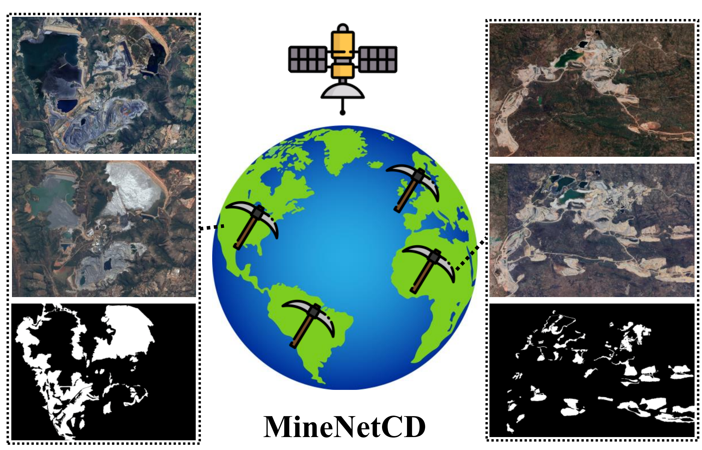
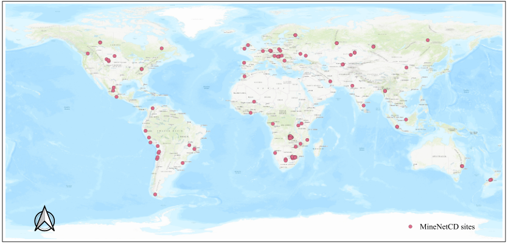
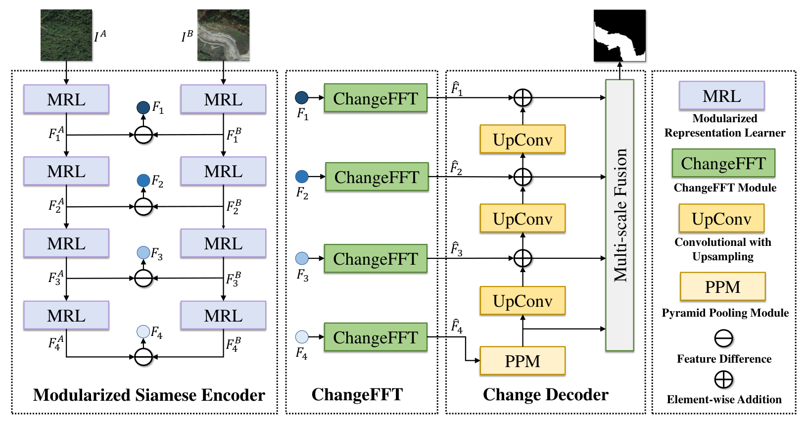

<div align="center">
<h1>MineNetCD </h1>
<h3>MineNetCD: A Benchmark for Global Mining Change Detection on Remote Sensing Imagery</h3>

[Weikang Yu](https://ericyu97.github.io/)<sup>1,2</sup>, [Xiaokang Zhang](https://xkzhang.info/)<sup>3</sup>, [Richard Gloaguen](https://scholar.google.de/citations?user=e1QDLQUAAAAJ&hl=de)<sup>2</sup>, [Xiao Xiang Zhu](https://www.asg.ed.tum.de/sipeo/home/)<sup>1</sup>, [Pedram Ghamisi](https://www.ai4rs.com/)<sup>2,4</sup>

<sup>1</sup> Technical University of Munich, <sup>2</sup> Helmholtz-Zentrum Dresden-Rossendorf (HZDR), <sup>3</sup> Wuhan University of Science and Technology, <sup>4</sup> Lancaster University

Paper: [IEEE TGRS 2024](https://ieeexplore.ieee.org/document/10744421) (DOI: 10.1109/TGRS.2024.3491715)
</div>


## Updates
``Nov. 9, 2024`` Our paper has been accepted on IEEE TGRS, and the code is released.
## Abstract
Monitoring land changes triggered by mining activities is crucial for industrial control, environmental management and regulatory compliance, yet it poses significant challenges due to the vast and often remote locations of mining sites. Remote sensing technologies have increasingly become indispensable to detect and analyze these changes over time. We thus introduce MineNetCD, a comprehensive benchmark designed for global mining change detection using remote sensing imagery. The benchmark comprises three key contributions. First, we establish a global mining change detection dataset featuring more than 70k paired patches of bitemporal high-resolution remote sensing images and pixel-level annotations from 100 mining sites worldwide. Second, we develop a novel baseline model based on a change-aware Fast Fourier Transform (ChangeFFT) module, which enhances various backbones by leveraging essential spectrum components within features in the frequency domain and capturing the channel-wise correlation of bitemporal feature differences to learn change-aware representations. Third, we construct a unified change detection (UCD) framework that currently integrates 20 change detection methods. This framework is designed for streamlined and efficient processing, utilizing the cloud platform hosted by HuggingFace. Extensive experiments have been conducted to demonstrate the superiority of the proposed baseline model compared with 19 state-of-the-art change detection approaches. Empirical studies on modularized backbones comprehensively confirm the efficacy of different representation learners on change detection. This benchmark represents significant advancements in the field of remote sensing and change detection, providing a robust resource for future research and applications in global mining monitoring. Dataset and Codes are available via the link.
## Overview
* **MineNetCD** is a pioneering work introducing a mining change detection benchmark, including a global-scale mining change detection dataset, a ChangeFFT-based model, and a unified change detection framework.
<p align="center">
  
</p>

* **MineNetCD Dataset** contains mining change detection samples collected from 100 sites globally.
<p align="center">
  
</p>

* **MineNetCD Model** is built based on a Modularized Siamese Encoder, a ChangeFFT module, and a Change Decoder.
<p align="center">
  
</p>

## Getting started
### Environment Preparation
Create a conda environment for MineNetCD
 ```console
conda create -n minenetcd
conda activate minenetcd
conda install pytorch torchvision pytorch-cuda=12.1 -c pytorch -c nvidia
pip install transformers
pip install accelerate
pip install datasets

git clone https://github.com/MzeroMiko/VMamba.git
cd VMamba
pip install -r requirements.txt
cd kernels/selective_scan && pip install .
```
Configurate the accelerate package:
```console
accelerate config
```
___
### Run the Experiments
#### Training a model:
```console
accelerate launch train.py --batch-size 32 --learning-rate 5e-5 --epochs 100 --backbone-type Swin_Diff_T --push-to-hub False --channel-mixing True
```

Avalaible Backbone Types: 
``ResNet_Diff_18``,``ResNet_Diff_50``,``ResNet_Diff_101``,``Swin_Diff_T``, ``Swin_Diff_S``, ``Swin_Diff_B``, ``VSSM_T_ST_Diff``, ``VSSM_S_ST_Diff``.

The model will be automatically saved under the path "./exp/minenetcd_upernet_``backbone_type``_Pretrained_ChannelMixing_Dropout/".
___
Testing a model:
```console
accelerate launch test.py --model $MODEL_ID$
```
The ``MODEL_ID`` can be the path of your trained model (e.g., "./exp/minenetcd_upernet_``backbone_type``_Pretrained_ChannelMixing_Dropout/")

___
Reproducing our results:

We have uploaded our pretrained model weights to the Huggingface Hub, the ``MODEL_ID`` is as follows:

For pretrained weights without ChangeFFT:

ResNet:

``ericyu/minenetcd_upernet_ResNet_Diff_18_Pretrained``

``ericyu/minenetcd_upernet_ResNet_Diff_50_Pretrained``

``ericyu/minenetcd_upernet_ResNet_Diff_101_Pretrained``

Swin Transformer:

``ericyu/minenetcd-upernet-Swin-Diff-S-Pretrained``

``ericyu/minenetcd-upernet-Swin-Diff-S-Pretrained``

``ericyu/minenetcd-upernet-Swin-Diff-S-Pretrained``

VMamba:

``ericyu/minenetcd-upernet-VSSM-T-ST-Diff-Pretrained``

``ericyu/minenetcd-upernet-VSSM-T-ST-Diff-Pretrained``

``ericyu/minenetcd-upernet-VSSM-T-ST-Diff-Pretrained``

For Pretrained weights with ChangeFFT:

ResNet:

``ericyu/minenetcd_upernet_ResNet_Diff_18_Pretrained_ChannelMixing_Dropout``

``ericyu/minenetcd_upernet_ResNet_Diff_50_Pretrained_ChannelMixing_Dropout``

``ericyu/minenetcd_upernet_ResNet_Diff_101_Pretrained_ChannelMixing_Dropout``

Swin Transformer:

``ericyu/minenetcd-upernet-Swin-Diff-T-Pretrained-ChannelMixing-Dropout``

``ericyu/minenetcd-upernet-Swin-Diff-S-Pretrained-ChannelMixing-Dropout``

``ericyu/minenetcd-upernet-Swin-Diff-B-Pretrained-ChannelMixing-Dropout``

VMamba:

``ericyu/minenetcd-upernet-VSSM-S-ST-Diff-Pretrained-ChannelMixing-Dropout``

``ericyu/minenetcd-upernet-VSSM-S-ST-Diff-Pretrained-ChannelMixing-Dropout``

``ericyu/minenetcd-upernet-VSSM-S-ST-Diff-Pretrained-ChannelMixing-Dropout``

Here is an example pf reproducing the results of MineNetCD on ``VSSM-S-ST-Diff-Pretrained-ChannelMixing-Dropout`` results:
```console
accelerate launch test.py --model ericyu/minenetcd-upernet-VSSM-S-ST-Diff-Pretrained-ChannelMixing-Dropout
```
___
Upload your model to Huggingface Hub

You can also push your model to Huggingface Hub by uncommenting and modifying the codeline in the ``test.py``:
```python
if accelerator.is_local_main_process:
    model = model.push_to_hub('minenetcd-upernet-VSSM-S-ST-Diff-Pretrained-ChannelMixing-Dropout')
```
___


If you find MineNetCD useful for your study, please kindly cite us:
```
@ARTICLE{10744421,
  author={Yu, Weikang and Zhang, Xiaokang and Gloaguen, Richard and Zhu, Xiao Xiang and Ghamisi, Pedram},
  journal={IEEE Transactions on Geoscience and Remote Sensing}, 
  title={MineNetCD: A Benchmark for Global Mining Change Detection on Remote Sensing Imagery}, 
  year={2024},
  volume={},
  number={},
  pages={1-1},
  keywords={Data mining;Remote sensing;Feature extraction;Benchmark testing;Earth;Transformers;Annotations;Graphical models;Distribution functions;Sustainable development;Mining change detection;remote sensing;benchmark;frequency domain learning;unified framework},
  doi={10.1109/TGRS.2024.3491715}}
```

## Future Development Schedule:

We will release the UCD codes soon! The codes will be released [here](https://github.com/EricYu97/UCD).

## Tutorial Avaiable!
We just added a very simple example as a tutorial for those who are interested in change detection, check [here](https://github.com/EricYu97/CDTutorial) for more details.

## Acknowledgement:

This codebase is heavily borrowed from [Transformers](https://github.com/huggingface/transformers) package.


